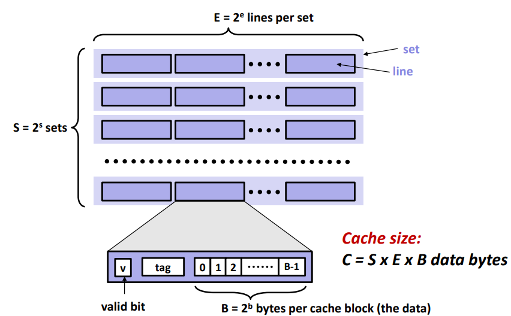

# part a - csim.c를 통해 만든 캐시 동작 방식 시뮬레이션
- test-csim은 csim.c를 컴파일하여 trace 내 명령어들을 실행하면서 cache 시뮬레이션을 한다.
- 따라서 csim.c는 캐시의 행동을 똑같이 해내야한다.
- 그러므로 우선 cache의 일반적인 구조를 사용하자



```c
// csim.c
typedef struct {

  bool valid;

  int tag;

  int timestamp;

} line_t; // cache block 구조체

  

typedef struct {

  line_t *lines;

} set_t;  // line들을 모아 하나의 set을 만듬

  

typedef struct {

  set_t *sets;

  size_t set_num;  // Number of set

  size_t line_num; // Number of lines per set

} cache_t; // 여러 set이 모여 하나의 cache 공간을 만듬

cache_t cache = {};

int set_bits = 0, block_bits = 0; // Cache word address
```
- 이렇게 캐시의 구조체를 만들고 캐시의 메타데이터를 만든다.
- 이제 시뮬레이션 할 명령어들을 알아보기위해 trace 파일의 명령어를 확인해보자 
- yi2.trace
```
L 10,1 // 주소 10에 있는 data를 2^1 byte(블록 크기)만큼 load
M 20,1 // 데이터 수정
L 22,1 // 22번 주소 load
S 18,1 // 18번 주소에 store
L 110,1
L 210,1
M 12,1
```

- 여기서 데이터 수정의 경우 cache에서 데이터를 읽어들이고 다시 cache에 접근해 데이터를 저장한다. 따라서 cache에 2번 접근하게 된다.
```c

for (int opt; (opt = getopt(argc, argv, "s:E:b:t:")) != -1;) {

	switch (opt) {
	
		case 's':
		
			set_bits = atoi(optarg); // Number of set index bits
		
			cache.set_num = 2 << set_bits; // Number of sets
		
		break;
		
		case 'E':
		
			cache.line_num = atoi(optarg); // Number of lines per set (set associativity)
		
		break;
		
		case 'b':
		
			block_bits = atoi(optarg); // Number of block bits
		
		break;
		
		case 't': // Input filename
		
			if (!(file = fopen(optarg, "r"))) { return 1; }
	
		break;
		
		default:
		
		// Unknown option
		
		return 1;
	
	}

}
```

- 캐시를 초기화 하고 trace에 대한 입력을 넣는다
- simulate 함수를 따로 생성한다.
- 캐시 hit가 생기는 상황찾기
	1. cache[set_index]에 있는 line을 모두 찾아본다
    2.  현재 line의 **valid**가 0인 경우 넘어간다
    3.  현재 line에 정보가 있다면 tag를 확인해본다
    4.  tag가 같다면 hits를 증가시키고 사용한 시점을 업데이트 하기 위해서 update함수를 실행한다.
나머지 miss, eviction 또한 똑같다.
``
```c
for (size_t i = 0; i < cache.line_num; ++i) {

	line_t* line = &set->lines[i];
	
	// Check if the cache line is valid
	
	if (!line->valid) { continue; }
	
	// Compare tag bits
	
	if (line->tag != tag) { continue; }
	
	// Cache hit!
	
	++hits;
	
	update(set, i);
	
	return;

}
```

- 캐시 miss가 나오는 상황
- 
```c 
for (size_t i = 0; i < cache.line_num; ++i) {

	line_t* line = &set->lines[i];
	
	if (line->valid) { continue; }
	
	line->valid = true;
	
	line->tag = tag;
	
	update(set, i);
	
	return;

}
```
- eviction이 나오는 상황
	-  사용한지 가장 오래된 line이 사용중이면 교체 -> eviction
```c
// No empty cache line, eviction!

++evictions;

// Look up for least recently used cache line

for (size_t i = 0; i < cache.line_num; ++i) {

	line_t* line = &set->lines[i];
	
	if (line->timestamp) { continue; }
	
	line->valid = true;
	
	line->tag = tag;
	
	update(set, i);
	
	return;

}
```

- 사용한 시점을 바꾸기위한 update함수
	 - **LRU replacement policy**에 따라 사용한지 가장 오래된 line을 고친다 (if (it->timestamp <= line->timestamp) 부분)
```c
void update(set_t *set, size_t line_no) {

	line_t *line = &set->lines[line_no];
	
	for (size_t i = 0; i < cache.line_num; ++i) {
	
		line_t *it = &set->lines[i];
		
		if (!it->valid) { continue; }
		
		if (it->timestamp <= line->timestamp) { continue; }
		
		--it->timestamp;
	
	}
	
	line->timestamp = cache.line_num - 1;

}
```